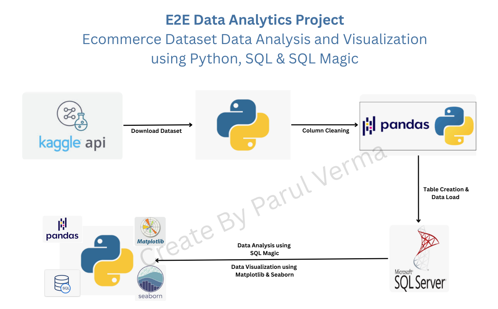

# Portfolio
## End to End Data Analytics Projects
### [Project 1: Ecommerce Data Analysis Project (Python + SQL)](https://github.com/vermaparul85/E2E-Data-Analytics-Projects/tree/main/Ecommerce-Data-Analysis)
Objective of this project is to work with a real-world ecommerce dataset, and perform data extraction, cleaning, analysis, and visualization to uncover valuable insights.

### [Project 2 - Students Performance Data Analysis Project (Python + SQL)](https://github.com/vermaparul85/E2E-Data-Analytics-Projects/tree/main/Student-Performance-Data-Analysis)
Objective of this project is to work with a real-world student performance dataset, performing data extraction, cleaning, analysis, and visualization to derive meaningful insights. The data has been analyzed in different ways using Pandas, SQL and visualization libraries (Matplotlib/Seaborn).

### [Project 3 - Uber Pickups Data Analysis Project (Python)](https://github.com/vermaparul85/E2E-Data-Analytics-Projects/edit/main/Uber-Pickup-Data-Analysis)
**Project Overview:**  
Objective of this project is to work with a real-world dataset, performing data extraction, cleaning, analysis, and visualization to derive meaningful insights. The data has been analyzed in different ways using Pandas and visualization libraries (Matplotlib/Seaborn/Folium). 
* **Data Extraction:** Retrieved the dataset from Kaggle using the Kaggle API in Python.
* **Data Cleaning & Feature Enginerring:** Utilized the Pandas library for cleaning and feature engineering.
* **Exploratory Data Analysis:** Conducted data analysis in Jupyter Notebook using Pandas.
* **Data Visualization:** Visualized trends and patterns through various charts with Matplotlib and Seaborn to highlight key insights and relationships.

## List of Python Programs - Beginner-Level
### [1. Rock, Paper, Scissor](https://github.com/vermaparul85/Python-Projects/tree/main/Rock-Paper-Scissor)
### [2. Guessing Game](https://github.com/vermaparul85/Python-Projects/tree/main/Guessing-Game)
### [3. Carnival Game](https://github.com/vermaparul85/Python-Projects/tree/main/Carnival-Game)
### [4. Hangman](https://github.com/vermaparul85/Python-Projects/tree/main/Hangman)
### [5. Tic-Tac-Toe Game](https://github.com/vermaparul85/Python-Projects/tree/main/Tic-Tac-Toe)
### [6. Password Generator](https://github.com/vermaparul85/Python-Projects/tree/main/Password-Generator)
### [7. Caesar-Cipher](https://github.com/vermaparul85/Python-Projects/tree/main/Caesar-Cipher)
### [8. Calculator Program](https://github.com/vermaparul85/Python-Projects/tree/main/Calculator)
### [9. Small Python Programs - Beginner Friendly](https://github.com/vermaparul85/Python-Projects/tree/main/Small-Python-Programs-Beginner-Level)

## **List of Python Programs - Intermediate-Level**
### [1. Playing Card War Game](https://github.com/vermaparul85/Python-Projects/tree/main/Playing-Cards-War-Game)
### [2. Playing Card Blackjack Game](https://github.com/vermaparul85/Python-Projects/tree/main/Playing-Cards-Games)

## **List of Python Projects - Real-World Use Cases**
### [1. Automate Word Document - Cover Letter Creation](https://github.com/vermaparul85/Python-Projects/tree/main/Automate-Cover-Letter-Creation)
